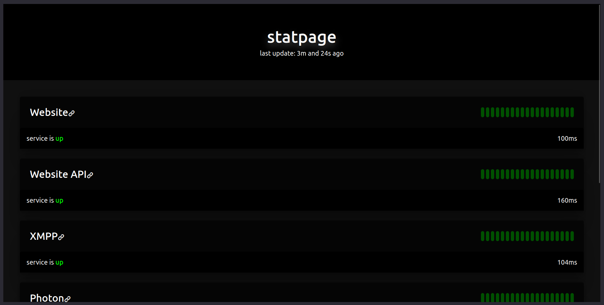

# statpage | a minimal status page application




I use statpage for my own services, so [here is a live demo I guess](https://stats.ngn.tf)

## 📑 Features
- No JavaScript
- Fully customizable and configurable
- Supports status checks for HTTP, HTTPS, TCP and TLS services
- Easy deployment with docker

## 🚀 Setup
### Docker 
```bash
git clone https://github.com/ngn13/statpage.git
cd statpage
docker build --tag statpage .
# create and edit the configuration file before
# starting the container - see the configuration section
docker run -d -v $PWD/data:/app/data     \
              -v $PWD/config:/app/config \
              -p 80:8877                 \
              --name statpage            \
              statpage
```

### Building from source
If you don't want to install statpage with docker, then you will 
need to compile it from the source as I do not release any binaries:
```bash
git clone https://github.com/ngn13/statpage.git
cd statpage
go build .
```
After that just run: `./statpage`

## ⚙️ Configuration
An example configuration file can be found at [config.json.example](config/config.json.example).
Copy this file to `config/config.json` to get started with the configuration.

> [!NOTE]  
> However you will need to restart the application if you edit the `interval` or the `address`
> config options. The other options do not require a restart.

### General config options
- `title`: Title for the status page, this will also be displayed on the header.
- `address`: The interface and the port that statpage will listen on
- `contact`: Contact URL that will be displayed at the bottom of the page
- `interval`: Service check interval 
- `services`: List of services to check

### Service config options
- `name`: Service name
- `address`: Service address, **NOT THE URL**. If you want to check `https://example.com:9191`, 
`address` would be `example.com:9191`.
- `type`: Service type. Options are: `HTTP`, `HTTPS`, `TCP` and `TLS`
- `data`: Data that will be sent. If you are using `HTTP` or `HTTPS` as the `type` then this 
would be the path. If you are using `TCP` or `TLS` as the `type` then this would be the raw 
data to send
- `link`: Link to the service that will be displayed. If you don't want to add a link, then leave
this one empty, aka set it to `""`
- `rule`: Rule for the service check 

### Rule config options 
- `contains`: The service status will be `up` if the service response contains this data.
- `not_contains`: The service status will be `down` if the service response contains this data.

You can use both of these options at the same time, keep in mind that `not_contains` have priority
over `contains`

## ✨ Customization 
If you want to customize the status page, check out [theme.css.example](config/theme.css.example)
file to get started.

## 📃 License 
This project is licensed under GNU General Public License version 3 (GPLv3). Please see 
[LICENSE.txt](LICENSE.txt) for more information.
